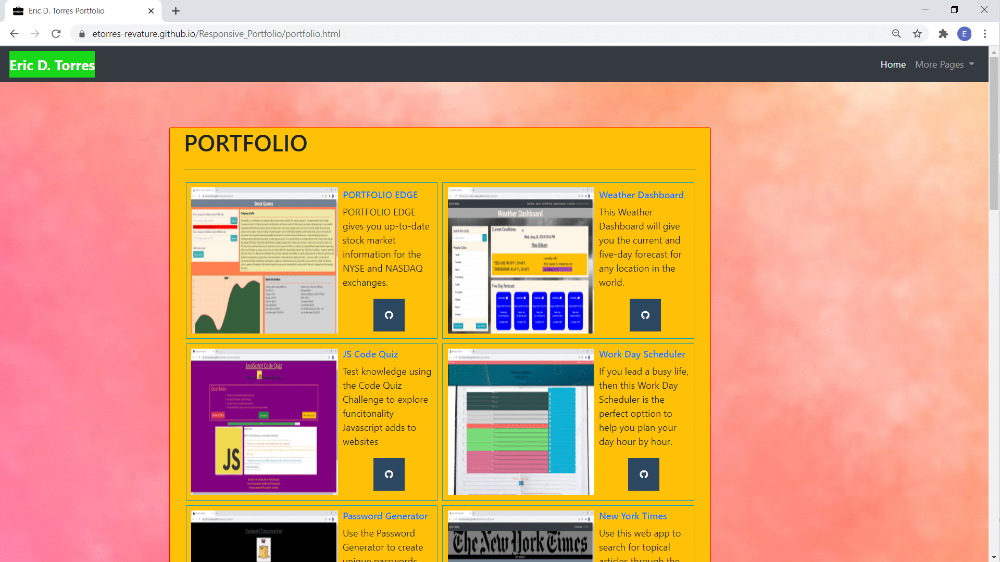
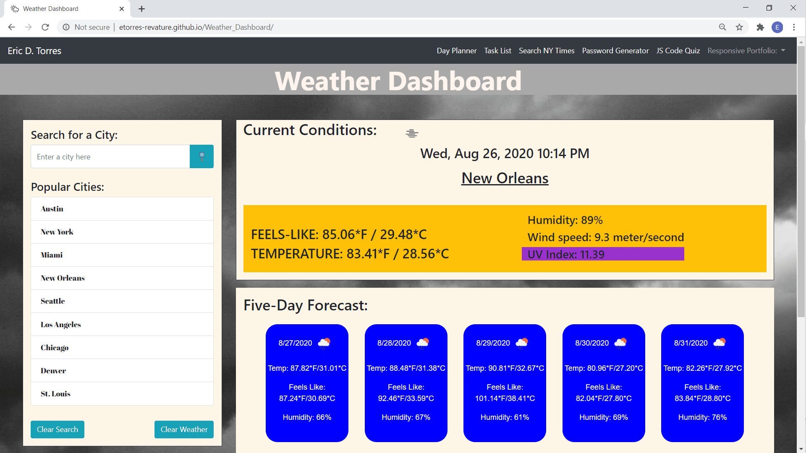
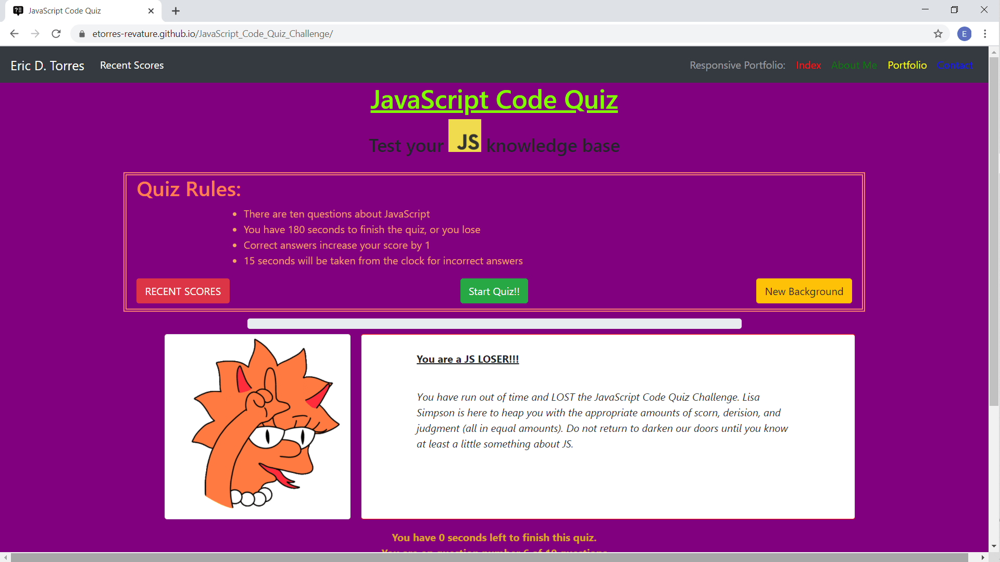

# Eric  D. Torres :sunglasses:

## Welcome to my GitHub profile

I am a journeyman coder with experience coding Java, Object-Oriented Programming, SQL, JavaScript, AWS, and PEGA. Using his foundation of research skills and strong analytical problem solving abilities, he has the ability to learn any coding language quickly.

My passion is learning about new coding design elements, cutting-edge coding languages, and creating logical frameworks for projects from start to finish.  

I also have the following certifications for the [PEGA](https://www.pega.com/?&utm_source=google&utm_medium=cpc&utm_campaign=Global_Brand_Exact&utm_term=pega%20systems&gloc=9025148&utm_content=pcrid%7c385502811043%7cpkw%7ckwd-299862464821%7cpmt%7ce%7cpdv%7cc%7c&gclid=Cj0KCQjwpZT5BRCdARIsAGEX0zlwEUJ1pHSIwyw83GZ1JUE6MsvC_rgS5LZ5nMBXMs6UlznUQ6ERP54aAqQ2EALw_wcB&gclsrc=aw.ds) Platform.

* PEGA Certified System Architect (2/2020);
* PEGA Senior Certified System Architect (3.2020);
* PEGA Business Architect (4/2020);
* PEGA Robotics System Architect (5/2020);

You can verify these certifications [here](https://academy.pega.com/verify-certification?fname=eric&lname=torres).

Currently, I am honing my skills by acquiring a Certificate in Full Stack Web Development from the University of Texas Austin (focus on JavaScript; MERN stack).

## Sample Projects

This is my [portfolio of projects](https://etorres-revature.github.io/Responsive_Portfolio/portfolio.html).

### A FEW SAMPLE PROJECTS

[PORTFOLIO EDGE](https://github.com/etorres-revature/Lucky_Mountaineers)

[Weather DashBoard](https://github.com/etorres-revature/Weather_Dashboard)

[JS Code Quiz](https://github.com/etorres-revature/JavaScript_Code_Quiz_Challenge)

### Connect with me on social media

### Lanuguages, Framworks, Libraries, Etc.

* HTML5
* CSS
* BOOTSTAP 4
* Tailwind CSS
* JavaScript
* jQuery
* Moment.js
* Chart.js

